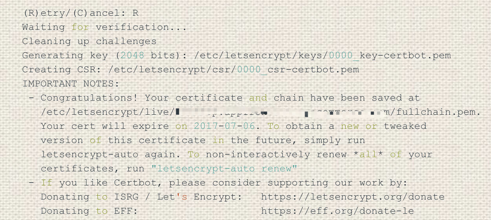

[原文地址](http://www.fancyecommerce.com/2017/04/07/centos-%E4%B8%8B%E5%AE%89%E8%A3%85-lets-encrypt-%E6%B0%B8%E4%B9%85%E5%85%8D%E8%B4%B9-ssl-%E8%AF%81%E4%B9%A6/)
## 功能
1. https证书，免费版，每三个月续签一次，可以用过脚本自动续签

## 安装
1. ssh登录到域名配置所在的主机（nginx，apache等）
2. 安装git `yum -y install git`
3. 输入 `git clone https://github.com/letsencrypt/letsencrypt`
4. `cd letsencrypt`
5. `chmod +x letsencrypt-auto`
6. 安装证书:
	* ./letsencrypt-auto certonly  --email 86533019@qq.com -d jenkins.jetbrains.org.cn
	* d参数后面对应的是域名，在执行的过程中，我遭遇了下面的报错：
	 `Total size: 44 M
    Downloading Packages:
    Running rpm_check_debug
    ERROR with rpm_check_debug vs depsolve:
    libgdbm.so.2()(64bit) is needed by python-libs-2.6.6-66.el6_8.x86_64
    ** Found 7 pre-existing rpmdb problem(s), 'yum check' output follows:
    4:perl-5.10.1-141.el6_7.1.x86_64 has missing requires of libgdbm.so.2()(64bit)
    4:perl-devel-5.10.1-141.el6_7.1.x86_64 has missing requires of gdbm-devel
    polkit-0.96-5.el6_4.x86_64 has missing requires of libeggdbus-1.so.0()(64bit)
    2:postfix-2.6.6-6.el6_5.x86_64 has missing requires of libmysqlclient.so.16()(64bit)
    2:postfix-2.6.6-6.el6_5.x86_64 has missing requires of libmysqlclient.so.	 16(libmysqlclient_16)(64bit)
    2:postfix-2.6.6-6.el6_5.x86_64 has missing requires of mysql-libs
    python-libs-2.6.6-52.el6.x86_64 has missing requires of libgdbm.so.2()(64bit)
    Your transaction was saved, rerun it with: yum load-transactiontmp/.yum_save_tx-2017-04-07-22-1798AqLE.yumtx
    Could not install OS dependencies. Aborting bootstrap!`
	* centos 6 需要安装 libgdbm.so.2：
		* `wget http://mirror.centos.org/centos/6/os/x86_64/Packages/gdbm-1.8.0-39.el6.x86_64.rpm`
       * `yum localinstall gdbm-1.8.0-39.el6.x86_64.rpm`
   
	* 完成后，重新执行上面的命令行：

7. 即为安装完成
## 配置
	1. web服务器，为这里是nginx，在nginx中添加代码：
	
            listen 443 ssl;
            ssl on;
            ssl_certificate /etc/letsencrypt/live/XXX.com/fullchain.pem;
            ssl_certificate_key /etc/letsencrypt/live/XXX.com/privkey.pem;
            ssl_protocols TLSv1 TLSv1.1 TLSv1.2; 
    2. 重启nginx，就可以放了https了
##续约
	1. linux中执行 crontab -e
	2. 添加代码
	 
	   `06 06 * * * /www/web/test/lets/certbot-master/certbot-auto renew   --force-renewal   --pre-hook "/etc/init.d/nginx stop" --post-hook "/etc/init.d/nginx start" >> /www/web_logs/letsencry.log 2>&1` 

## 日常晒猫

